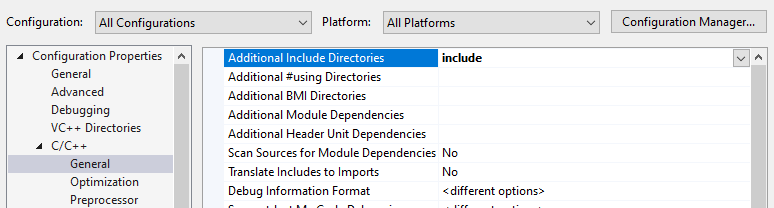
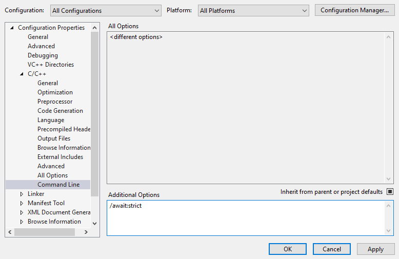

This guide will show you how to integrate Squid::Tasks into a standalone Visual Studio-based C++ project.

Including the Headers
-------------------
To integrate the Squid::Tasks library into your project, we recommend first copying the entire include Squid::Tasks `include` directory into your project.

You must then add the path of the include directory to the list of include directories in your project. In __Visual Studio__, this is done by right-clicking your project and selecting Properties. Then navigate to Configuration Properties -> C/C++ -> General, and add the the path to the include directory to “Additional Include Directories”.

Enabling Coroutines for C++14/17 (skip this step if using C++20)
----------------------------------------------------------------
C++ coroutines were only formally added to the standard with C++20.  In order to use them with earlier standards (C++14 or C++17), you must enable coroutines using a special compiler-specific compile flag.

In __Visual Studio__, this is done by right-clicking your project and selecting Properties.  Then navigate to Configuration Properties -> C/C++ -> Command Line, and add `/await:strict` to “Additional Options”.

(__IMPORTANT NOTE:__ If you are using VS 16.10 or earlier, you should instead add `/await` to "Additional Options", as shown below.)

If you are using __Clang__, you will need to add -fcoroutines-ts to your compiler command-line compilation parameters.

If you are using the __Clang Platform Toolset__ from within Visual Studio, you will need to add -Xclang -fcoroutines-ts to your compiler command-line compilation parameters.