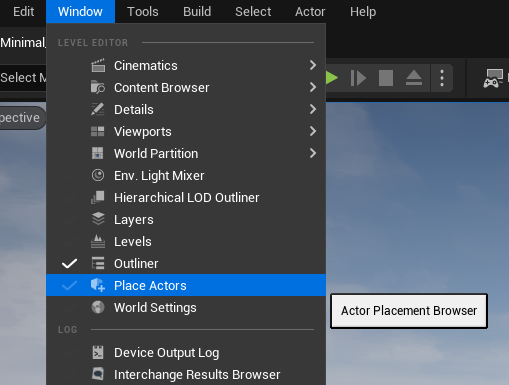
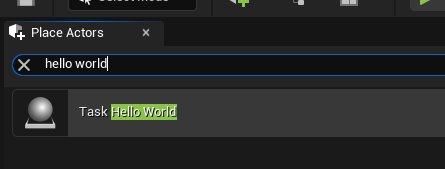
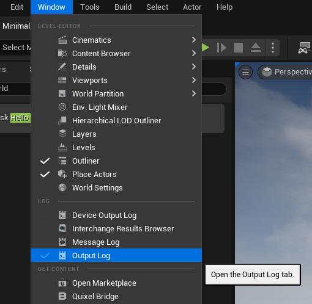

This guide will show you how to integrate Squid::Tasks into an Unreal Engine 4 game project.

Prerequisites
-------------

To use this guide, you must have:

 * An installation of Unreal Engine 5, built from source code. If you don't have this yet, [This Guide](https://docs.unrealengine.com/4.27/en-US/ProgrammingAndScripting/ProgrammingWithCPP/DownloadingSourceCode/) published by Epic will walk you through the process of downloading the source code, doing the initial setup, and compiling the source code. Note that this guide is for Unreal Engine 4. There isn't an official guide out for Unreal Engine 5 yet, because as of this writing UE5 has not officially released, so you'll need to do a little searching to find the UE5 source.
 * An Unreal Engine game project, configured to use C++. If you don't have this yet, [This Guide](https://docs.unrealengine.com/4.27/en-US/Basics/Projects/Browser/) published by Epic will guide you though the process of creating a new project. Remember to configure your project to use C++, not blueprints!

Step 1: Enabling Compiler Support
---------------------------------
(__NOTE: If you're compiling with C++20, you should skip this step and go directly to Step 2__. If you're not sure which language standard you're compiling with, it's best to assume you're using an earlier standard than C++20.)

Before we can use C++ coroutines, we need to tell the compiler to enable support for coroutines. In previous versions of Unreal, we would've needed to make edits to engine files, but in Unreal Engine 5, this can be done easily through user configuration files. Specifically, we will be editing the [Target](https://docs.unrealengine.com/4.27/en-US/ProductionPipelines/BuildTools/UnrealBuildTool/TargetFiles/) files for our project.

The name of the files we need to edit are different from game to game. If our game project was called MyGame, then we'd need to edit a file called `MyGame.Target.cs`, and a file called `MyGameEditor.Target.cs`, and they'll both probably be located at `<project directory>/Source/MyGame[Editor].Target.cs`

We'll document the process for `MyGameEditor.Target.cs`, and the process will be identical for `MyGame.Target.cs`.

The contents of `MyGameEditor.Target.cs` should look something like this, although again it will differ from game to game:
```c#
// Copyright Epic Games, Inc. All Rights Reserved.

using UnrealBuildTool;
using System.Collections.Generic;

public class MyGameEditorTarget : TargetRules
{
	public SurferEditorTarget( TargetInfo Target) : base(Target)
	{
		Type = TargetType.Editor;
		DefaultBuildSettings = BuildSettingsVersion.V2;
	}
}
```

All we need to do is add a single line at the bottom of the constructor of `SurferEditorTarget`:

`bEnableCppCoroutinesForEvaluation = true;`

Once this is enabled, start a build. It may take a while, so it's a good idea to have this running while you work on the next steps.


Step 2: Adding the Squid::Tasks Plugin
--------------------------------------

The Squid::Tasks source code is maintained in two different formats: One for standalone projects, and one as an Unreal Engine plugin. Since we're integrating into Unreal Engine 5, we'll use the Unreal Engine plugin.

 1. Locate your game project's directory (It's the directory that contains the file `<project name>.uproject`).
 2. Within your project directory, find and open the directory called `Plugins`. If it doesn't exist yet, create it.
 3. In a separate window, open the SquidTasks source code and navigate into the `unreal/Plugins` directory.
 4. Copy the `SquidTasks` directory from the Squid::Tasks source into your project's `Plugins` directory.

Step 3: Add SquidTasks as a dependency of our game module
---------------------------------------------------------
Now that we've added our plugin, we need to tell our game's [module](https://docs.unrealengine.com/4.27/en-US/ProgrammingAndScripting/ProgrammingWithCPP/Modules/) to rely on it. 

The name of the file we need to edit is different from game to game. If our game project was called MyGame, then we'd need to edit a file called `MyGame.Build.cs`, and it will probably be located at `<project directory>/Source/MyGame/MyGame.Build.cs`.

The contents of this file should look something like this, although again it will differ from game to game, and from module to module:

```c#
using UnrealBuildTool;

public class MyGame : ModuleRules
{
	public MyGame(ReadOnlyTargetRules Target) : base(Target)
	{
		PCHUsage = PCHUsageMode.UseExplicitOrSharedPCHs;
	
		PublicDependencyModuleNames.AddRange(new string[] { "Core", "CoreUObject", "Engine", "InputCore" });
	}
}
```

To add a dependency to SquidTasks, all we need to do is add an entry to `PublicDependencyModuleNames` so that it looks like this:

```c#
PublicDependencyModuleNames.AddRange(new string[] { "Core", "CoreUObject", "Engine", "InputCore", "SquidTasks" });
```

Step 4: Write a Task
--------------------
Squid::Tasks has now been integrated into our game module. To verify that it works, let's make a new actor and verify that tasks compile and run.

In the same directory as the `____.Build.cs` file we just edited, make a new file called `TaskHelloWorld.h`, and paste in the following code:

```c++
#pragma once
#include "SquidTasks/Task.h"
#include "TaskHelloWorld.generated.h"

UCLASS()
class ATaskHelloWorld : public AActor
{
	GENERATED_BODY()
public:
	ATaskHelloWorld() {
		PrimaryActorTick.bCanEverTick = true;
	}

	virtual void BeginPlay() override {
		Super::BeginPlay();
		MyTaskInstance = HelloWorldTask();
	}

	virtual void Tick(float DT) override {
		Super::Tick(DT);
		MyTaskInstance.Resume();
	}

private:
	Task<> MyTaskInstance;

	Task<> HelloWorldTask() {
		UE_LOG(LogTemp, Log, TEXT("Hello world at the beginning of the task!"));

		co_await Suspend();

		UE_LOG(LogTemp, Log, TEXT("Hello world on the next frame!"));

		while (true) {
			UE_LOG(LogTemp, Log, TEXT("Hello world inside the while loop!"));

			co_await Suspend();
		}
	}
};
```

In this example code, the `HelloWorldTask()` member function is a C++ coroutine written using the Squid::Tasks library.

In `BeginPlay()`, we call our `HelloWorldTask()` and store the task instance in the `MyTaskInstance` member variable. In `Tick()`, all we do is call `Resume()` on our stored task instance. 

We can now write stateful game code inside of `HelloWorldTask()`, and our actor will resume our task once per frame.

Step 5: Test our Task
---------------------

To test our task, start up the Unreal Editor, and load the game project that contains your `ATaskHelloWorld` actor.

First, open the "Place Actors" Window:



Next, search for the "Task Hello World" actor, and drag one into the scene:



In order to see the "hello" world text we're logging, we need to open the Output Log:



Finally, we're ready to hit Play to test our actor. We'll know it worked if we see this text in the Output Log:

```
LogTemp: Hello world at the beginning of the task!
LogTemp: Hello world on the next frame!
LogTemp: Hello world inside the while loop!
LogTemp: Hello world inside the while loop!
LogTemp: Hello world inside the while loop!
LogTemp: Hello world inside the while loop!
LogTemp: Hello world inside the while loop!
LogTemp: Hello world inside the while loop!
```

Squid::Tasks has now been successfully integrated into our game project!